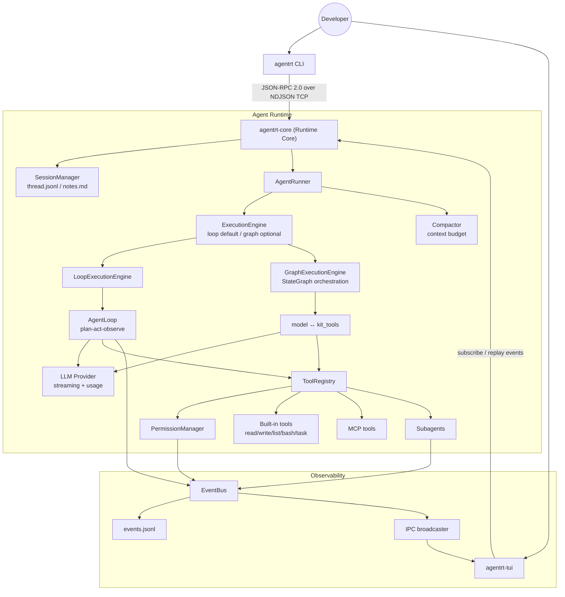

# Agent Runtime Kit

Local AI Agent runtime framework with a long-running Agent Runtime Core, typed
IPC, event streaming, tool permissions, session memory, context compaction,
subagents, and MCP tools.

[中文](README.md) | English

[](https://github.com/zed123214/agent-runtime-kit/actions/workflows/ci.yml)
[](https://www.python.org/)
[](https://docs.pydantic.dev/)
[](https://textual.textualize.io/)
[](LICENSE)

## Why This Project

Modern AI agents need more than an LLM API wrapper. They need a long-running
execution process, typed IPC, observable event streams, safe local tool
execution, persistent session memory, and a unified extension model for tools,
skills, subagents, and MCP servers.

Agent Runtime Kit implements those runtime primitives in Python. The current
provider implementation uses Anthropic models, but the core runtime is designed
around provider boundaries: the main value is the runtime core, protocol, tool,
permission, session, and event infrastructure around the model.

## Supported Runtime

This repository is packaged for Linux/macOS-style environments. Native Windows
runtime execution is not a supported target because the current runbook,
process-control commands, and shell-tool behavior assume POSIX semantics.

On Windows machines, use WSL2 or Docker for runtime experiments. The source code
and documentation can still be reviewed directly from Windows.

## Architecture



## Core Capabilities

1. **Runtime Core + CLI/TUI clients**: the long-running `agentrt-core` process
   centrally manages session, execution, and event state. Live sessions are bound to their creating
   connection; disconnects cancel in-flight work, while persisted events remain
   available for read-only replay through a strong random run ID.
2. **Typed IPC**: requests, responses, errors, and events are modeled with
   Pydantic and exposed through JSON-RPC 2.0 over NDJSON TCP.
3. **Generated protocol docs**: `WIRE_PROTOCOL.md` is generated from source
   protocol models so documentation does not drift from code.
4. **Pluggable execution engines**: `AgentRunner` uses the typed
   `ExecutionEngine` boundary. The default loop preserves existing behavior;
   the optional Graph engine schedules an explicit `model <-> kit_tools` graph
   while reusing the provider, tools, permissions, events, and SessionStore.
5. **ToolRegistry + PermissionManager**: built-in tools and MCP tools share
   schema validation, permission checks, event emission, and structured results.
6. **Session memory**: full message history is stored in `thread.jsonl`, while
   curated long-term notes live in `notes.md`.
7. **Context governance**: tool results can be truncated, context watermarks are
   tracked, and compact summaries can replace oversized histories.
8. **Skills, Subagents, and MCP**: Markdown skills, isolated subagents, and MCP
   tools reuse the same registry, permission, event, and runner primitives.

## Resume Evidence Map

| Resume claim | Evidence in this repository |
| --- | --- |
| Runtime Core + CLI/TUI multi-process architecture | `src/agent_runtime/core/app.py`, `src/agent_runtime/cli/`, `src/agent_runtime/tui/`, `docs/architecture.md` |
| JSON-RPC 2.0 over NDJSON TCP | `src/agent_runtime/core/bus/`, `src/agent_runtime/core/transport/`, `WIRE_PROTOCOL.md` |
| Type-safe protocol boundary | Pydantic protocol models, strict `mypy`, generated `WIRE_PROTOCOL.md` |
| Observable event stream | `EventBus`, `events.jsonl`, replayable client subscriptions |
| Runtime-level tool permission control | `src/agent_runtime/core/permissions/`, `docs/tool-permissions.md`, `examples/permissions/` |
| Recoverable LLM/tool execution loop | `src/agent_runtime/core/loop.py`, `src/agent_runtime/core/runner.py`, unit and integration tests |
| Session memory and context governance | `src/agent_runtime/core/session/`, `src/agent_runtime/core/compact/`, `docs/session-memory.md` |
| Unified extension model | `src/agent_runtime/core/skills/`, `src/agent_runtime/core/subagent/`, `src/agent_runtime/core/mcp/`, `examples/` |

## Quick Start

### Requirements

- Linux/macOS, WSL2, or Docker
- Python 3.12
- [uv](https://docs.astral.sh/uv/)
- `ANTHROPIC_API_KEY` for real LLM runs

### Install

```bash
git clone https://github.com/zed123214/agent-runtime-kit.git
cd agent-runtime-kit
uv sync
```

### Configure

The four shell/file tools execute through Sandbox Runtime. M0 defaults to
`[sandbox] backend = "local"`; `AGENTRT_SANDBOX_BACKEND=local` overrides TOML.
Local uses the host cwd and filesystem, accepts existing absolute paths, and
provides no physical isolation. Release does not delete project or user files.
The `kubernetes` value fails before startup listening because it is not implemented
in M0; other undelivered Sandbox fields are rejected. This delivery is implemented
but untested and unaccepted. See the [M0 implementation notes](docs/sandbox-m0-implementation.md).

```bash
cp .env.example .env
```

Example:

```env
AGENTRT_HOST=127.0.0.1
AGENTRT_PORT=7437
AGENTRT_LOG_LEVEL=INFO
AGENTRT_LOG_FILE=~/.agentrt/logs/core.log
AGENTRT_LOG_FORMAT=text
# ANTHROPIC_API_KEY=sk-ant-your-key-here
# AGENTRT_LLM_DEFAULT_MODEL=claude-sonnet-4-6
# AGENTRT_MAX_STEPS=20
# AGENTRT_ENGINE=loop
```

Never commit a real API key. Keep local secrets in `.env` or your shell
environment.

### Run

```bash
uv run agentrt-core
uv run agentrt ping
uv run agentrt run --goal "Inspect this repository and summarize the project structure"
uv run agentrt-tui
```

### Optional LangGraph engine and SQLite recovery (P1/P2)

The original Quick Start remains on `loop` and installs no Graph dependency.
LangGraph owns explicit orchestration only; KitAgent continues to own providers,
native messages, tool and permission governance, events, SessionStore, and the
runner's single terminal boundary. Enable it in PowerShell:

```powershell
uv sync --extra graph
$env:AGENTRT_ENGINE = 'graph'
uv run agentrt-core
```

Connect from a second PowerShell window:

```powershell
$env:AGENTRT_ENGINE = 'graph'
uv run agentrt chat
```

The default Graph backend uses process-local `InMemorySaver` state to continue
one Session and isolate threads; `thread.jsonl` remains authoritative. Enable
the SQLite backend explicitly for `agentrt-core` restart recovery and human
approval:

```powershell
uv sync --extra graph-sqlite
$env:AGENTRT_ENGINE = 'graph'
$env:AGENTRT_GRAPH_CHECKPOINT_BACKEND = 'sqlite'
$env:AGENTRT_DATA_ROOT = 'D:\agentrt-data'
uv run agentrt-core
```

P2 uses the official async SQLite saver for Graph state and interrupts, plus a
separate RecoveryStore for capability hashes, resume leases, transcript commit
progress, and the tool journal. A logical run keeps its run ID and monotonic
event cursor across resume attempts. See [Optional LangGraph Engine](docs/graph-engine.md)
for memory compatibility and [Durable Graph Recovery and Human Approval](docs/durable-recovery.md)
for recovery, HITL, crash-window, and scope details.

## Event Stream Example

```json
{"type":"run.started","run_id":"20260629-101500-a1b2c3d4e5f67890a1b2c3d4e5f67890","correlation_id":"20260629-101500-a1b2c3d4e5f67890a1b2c3d4e5f67890","session_id":"sess-abc123","node_id":null,"event_seq":1,"goal":"...","ts":"..."}
{"type":"llm.token","run_id":"20260629-101500-a1b2c3d4e5f67890a1b2c3d4e5f67890","correlation_id":"20260629-101500-a1b2c3d4e5f67890a1b2c3d4e5f67890","session_id":"sess-abc123","node_id":null,"event_seq":2,"token":"I","ts":"..."}
{"type":"tool.call_started","run_id":"20260629-101500-a1b2c3d4e5f67890a1b2c3d4e5f67890","correlation_id":"20260629-101500-a1b2c3d4e5f67890a1b2c3d4e5f67890","session_id":"sess-abc123","node_id":null,"event_seq":3,"tool_use_id":"toolu_01","tool_name":"list_dir","params":{},"ts":"..."}
{"type":"permission.requested","run_id":"20260629-101500-a1b2c3d4e5f67890a1b2c3d4e5f67890","correlation_id":"20260629-101500-a1b2c3d4e5f67890a1b2c3d4e5f67890","session_id":"sess-abc123","node_id":null,"event_seq":4,"tool_use_id":"toolu_02","tool_name":"bash","params":{"command":"..."},"param_preview":"command=...","ts":"..."}
{"type":"tool.call_finished","run_id":"20260629-101500-a1b2c3d4e5f67890a1b2c3d4e5f67890","correlation_id":"20260629-101500-a1b2c3d4e5f67890a1b2c3d4e5f67890","session_id":"sess-abc123","node_id":null,"event_seq":5,"tool_use_id":"toolu_01","tool_name":"list_dir","elapsed_ms":3,"output":"...","ts":"..."}
{"type":"run.finished","run_id":"20260629-101500-a1b2c3d4e5f67890a1b2c3d4e5f67890","correlation_id":"20260629-101500-a1b2c3d4e5f67890a1b2c3d4e5f67890","session_id":"sess-abc123","node_id":null,"event_seq":6,"status":"success","reason":null,"steps":2,"error":null,"ts":"..."}
```

## Repository Map

```text
agent-runtime-kit/
|-- README.md
|-- README.en.md
|-- RUNBOOK.md
|-- WIRE_PROTOCOL.md
|-- docs/
|   |-- architecture.md
|   |-- agent-loop.md
|   |-- graph-engine.md
|   |-- durable-recovery.md
|   |-- tool-permissions.md
|   |-- session-memory.md
|   |-- skills-subagents-mcp.md
|   `-- project-highlights.md
|-- examples/
|   |-- graph_offline_demo.py
|   |-- durable_recovery_demo.py
|   |-- basic_run/
|   |-- permissions/
|   |   `-- trace_permission_flow.py
|   |-- skills/
|   `-- mcp/
|-- scripts/
|   |-- generate_wire_protocol.py
|   `-- check_wire_protocol.py
|-- src/agent_runtime/
|   |-- cli/
|   |-- tui/
|   `-- core/
|       |-- app.py
|       |-- engine/
|       |   |-- base.py
|       |   |-- loop_engine.py
|       |   `-- router.py
|       |-- graph/
|       |-- runner.py
|       |-- loop.py
|       |-- bus/
|       |-- transport/
|       |-- tools/
|       |-- permissions/
|       |-- session/
|       |-- compact/
|       |-- skills/
|       |-- subagent/
|       |-- mcp/
|       `-- trace/
`-- tests/
    |-- unit/
    `-- integration/
```

## Development

The base install excludes LangGraph. It supports the base checks and tests that
are neither Graph-specific nor online integration tests:

```bash
uv run ruff check src tests scripts examples
uv run ruff format --check src tests scripts examples
uv run pytest tests/ -m "not graph and not recovery and not integration" -v
uv run python scripts/check_wire_protocol.py --check
```

The full source type check includes the SQLite recovery modules, so install the
graph-sqlite extra before running Mypy:

```bash
uv sync --extra graph
uv run pytest tests/ -m "graph and not recovery and not integration" -v
uv sync --extra graph-sqlite
uv run mypy src
uv run pytest tests/ -m "recovery and not integration" --strict-markers -v
```

On native Windows, if `uv` script entry points fail with a trampoline path
error, run tools through Python modules instead:

```bash
uv run python -m mypy src
uv run python -m pytest tests/ -v
```

Regenerate protocol docs after changing `src/agent_runtime/core/bus/` models:

```bash
uv run python scripts/generate_wire_protocol.py
```

## Documentation

- [Architecture](docs/architecture.md)
- [Agent Loop](docs/agent-loop.md)
- [Optional LangGraph Engine](docs/graph-engine.md)
- [Durable Graph Recovery and Human Approval](docs/durable-recovery.md)
- [Tool Permissions](docs/tool-permissions.md)
- [Session Memory](docs/session-memory.md)
- [Skills, Subagents, and MCP](docs/skills-subagents-mcp.md)
- [Project Highlights](docs/project-highlights.md)
- [Runbook](RUNBOOK.md)
- [Wire Protocol](WIRE_PROTOCOL.md)

## Safety Notes

- `.env`, logs, session data, caches, virtual environments, and local workspaces
  should not be committed.
- Shell, file writes, and external MCP tools are routed through the permission
  system before execution.
- This is a portfolio and learning project. Production use would require
  additional sandboxing, security review, resource isolation, and operational
  hardening.

## License

MIT License. See [LICENSE](LICENSE).
