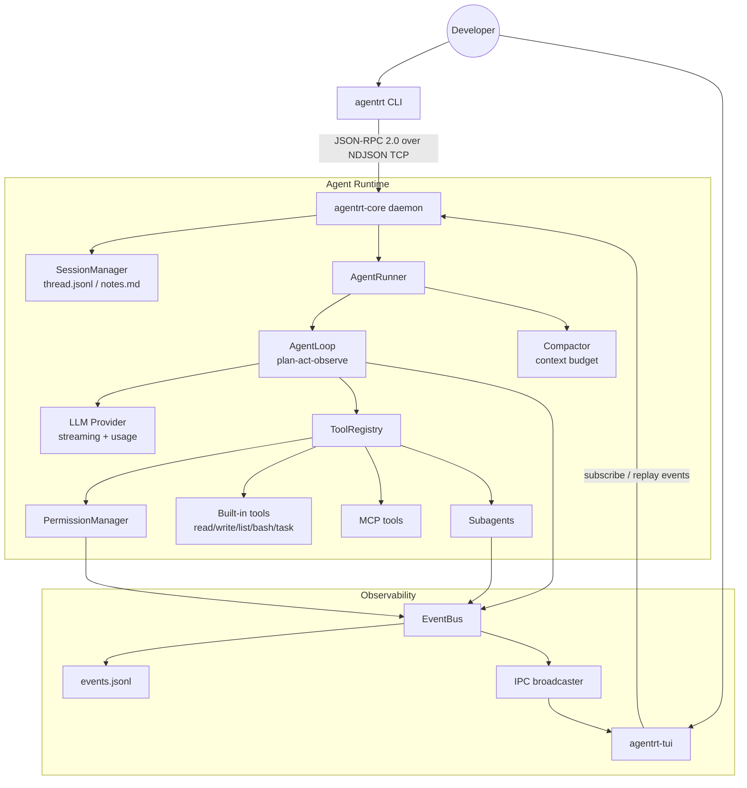

# Agent Runtime Kit

Local AI Agent runtime framework with daemon execution, typed IPC, event
streaming, tool permissions, session memory, context compaction, subagents, and
MCP tools.

[](https://www.python.org/)
[](https://docs.pydantic.dev/)
[](https://textual.textualize.io/)
[](LICENSE)

## Why This Project

Modern AI agents need more than an LLM API wrapper. They need a long-running
execution process, typed IPC, observable event streams, safe local tool
execution, persistent session memory, and a unified extension model for tools,
skills, subagents, and MCP servers.

Agent Runtime Kit implements those runtime primitives in Python. The current
provider implementation uses Anthropic models, but the core runtime is designed
around provider boundaries: the main value is the daemon, protocol, tool,
permission, session, and event infrastructure around the model.

## Supported Runtime

This repository is packaged for Linux/macOS-style environments. Native Windows
runtime execution is not a supported target because the current runbook,
process-control commands, and shell-tool behavior assume POSIX semantics.

On Windows machines, use WSL2 or Docker for runtime experiments. The source code
and documentation can still be reviewed directly from Windows.

## Architecture



## Core Capabilities

1. **Daemon + CLI/TUI clients**: long-running agent execution is decoupled from
   frontend lifecycle. CLI/TUI clients can disconnect while the daemon keeps the
   runtime state.
2. **Typed IPC**: requests, responses, errors, and events are modeled with
   Pydantic and exposed through JSON-RPC 2.0 over NDJSON TCP.
3. **Generated protocol docs**: `WIRE_PROTOCOL.md` is generated from source
   protocol models so documentation does not drift from code.
4. **ReAct-style AgentLoop**: the runtime handles streaming LLM output,
   `tool_use`, validated tool execution, `tool_result` injection, max-step
   limits, cancellation, and failure recovery.
5. **ToolRegistry + PermissionManager**: built-in tools and MCP tools share
   schema validation, permission checks, event emission, and structured results.
6. **Session memory**: full message history is stored in `thread.jsonl`, while
   curated long-term notes live in `notes.md`.
7. **Context governance**: tool results can be truncated, context watermarks are
   tracked, and compact summaries can replace oversized histories.
8. **Skills, Subagents, and MCP**: Markdown skills, isolated subagents, and MCP
   tools reuse the same registry, permission, event, and runner primitives.

## Resume Evidence Map

| Resume claim | Evidence in this repository |
| --- | --- |
| Daemon + CLI/TUI multi-process architecture | `src/agent_runtime/core/app.py`, `src/agent_runtime/cli/`, `src/agent_runtime/tui/`, `docs/architecture.md` |
| JSON-RPC 2.0 over NDJSON TCP | `src/agent_runtime/core/bus/`, `src/agent_runtime/core/transport/`, `WIRE_PROTOCOL.md` |
| Type-safe protocol boundary | Pydantic protocol models, strict `mypy`, generated `WIRE_PROTOCOL.md` |
| Observable event stream | `EventBus`, `events.jsonl`, replayable client subscriptions |
| Runtime-level tool permission control | `src/agent_runtime/core/permissions/`, `docs/tool-permissions.md`, `examples/permissions/` |
| Recoverable LLM/tool execution loop | `src/agent_runtime/core/loop.py`, `src/agent_runtime/core/runner.py`, unit and integration tests |
| Session memory and context governance | `src/agent_runtime/core/session/`, `src/agent_runtime/core/compact/`, `docs/session-memory.md` |
| Unified extension model | `src/agent_runtime/core/skills/`, `src/agent_runtime/core/subagent/`, `src/agent_runtime/core/mcp/`, `examples/` |

## Quick Start

### Requirements

- Linux/macOS, WSL2, or Docker
- Python 3.12
- [uv](https://docs.astral.sh/uv/)
- `ANTHROPIC_API_KEY` for real LLM runs

### Install

```bash
git clone <your-repo-url>
cd agent-runtime-kit
uv sync
```

### Configure

```bash
cp .env.example .env
```

Example:

```env
AGENTRT_HOST=127.0.0.1
AGENTRT_PORT=7437
AGENTRT_LOG_LEVEL=INFO
AGENTRT_LOG_FILE=~/.agentrt/logs/core.log
AGENTRT_LOG_FORMAT=text
# ANTHROPIC_API_KEY=sk-ant-your-key-here
# AGENTRT_LLM_DEFAULT_MODEL=claude-sonnet-4-6
# AGENTRT_MAX_STEPS=20
```

Never commit a real API key. Keep local secrets in `.env` or your shell
environment.

### Run

```bash
uv run agentrt-core
uv run agentrt ping
uv run agentrt run --goal "Inspect this repository and summarize the project structure"
uv run agentrt-tui
```

## Event Stream Example

```json
{"type":"run.started","run_id":"20260629-101500-a1b2c3","goal":"...","ts":"..."}
{"type":"llm.token","run_id":"20260629-101500-a1b2c3","token":"I","ts":"..."}
{"type":"tool.started","run_id":"20260629-101500-a1b2c3","tool_name":"list_dir","ts":"..."}
{"type":"permission.requested","run_id":"20260629-101500-a1b2c3","tool_name":"bash","ts":"..."}
{"type":"tool.finished","run_id":"20260629-101500-a1b2c3","tool_name":"list_dir","is_error":false,"ts":"..."}
{"type":"run.finished","run_id":"20260629-101500-a1b2c3","status":"success","ts":"..."}
```

## Repository Map

```text
agent-runtime-kit/
|-- README.md
|-- RUNBOOK.md
|-- WIRE_PROTOCOL.md
|-- docs/
|   |-- architecture.md
|   |-- agent-loop.md
|   |-- tool-permissions.md
|   |-- session-memory.md
|   |-- skills-subagents-mcp.md
|   `-- project-highlights.md
|-- examples/
|   |-- basic_run/
|   |-- permissions/
|   |-- skills/
|   `-- mcp/
|-- scripts/
|   |-- generate_wire_protocol.py
|   `-- check_wire_protocol.py
|-- src/agent_runtime/
|   |-- cli/
|   |-- tui/
|   `-- core/
|       |-- app.py
|       |-- runner.py
|       |-- loop.py
|       |-- bus/
|       |-- transport/
|       |-- tools/
|       |-- permissions/
|       |-- session/
|       |-- compact/
|       |-- skills/
|       |-- subagent/
|       |-- mcp/
|       `-- trace/
`-- tests/
    |-- unit/
    `-- integration/
```

## Development

```bash
uv run ruff check src tests scripts
uv run ruff format --check src tests scripts
uv run mypy src
uv run pytest tests/ -v
uv run python scripts/check_wire_protocol.py --check
```

Regenerate protocol docs after changing `src/agent_runtime/core/bus/` models:

```bash
uv run python scripts/generate_wire_protocol.py
```

## Documentation

- [Architecture](docs/architecture.md)
- [Agent Loop](docs/agent-loop.md)
- [Tool Permissions](docs/tool-permissions.md)
- [Session Memory](docs/session-memory.md)
- [Skills, Subagents, and MCP](docs/skills-subagents-mcp.md)
- [Project Highlights](docs/project-highlights.md)
- [Runbook](RUNBOOK.md)
- [Wire Protocol](WIRE_PROTOCOL.md)

## Safety Notes

- `.env`, logs, session data, caches, virtual environments, and local workspaces
  should not be committed.
- Shell, file writes, and external MCP tools are routed through the permission
  system before execution.
- This is a portfolio and learning project. Production use would require
  additional sandboxing, security review, resource isolation, and operational
  hardening.

## License

MIT License. See [LICENSE](LICENSE).
