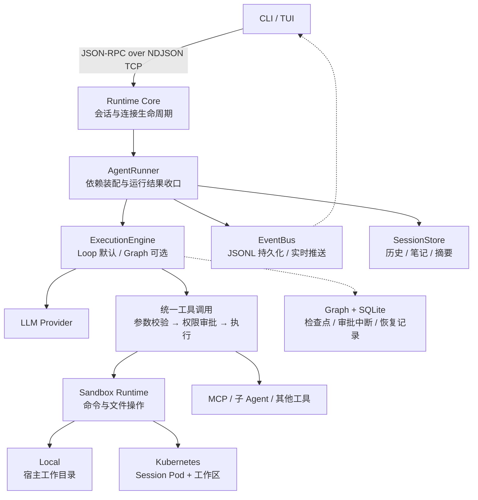

# Agent Runtime Kit

**面向开发者自动化的 AI Agent 运行时，支持可观测执行、人工审批、故障恢复与 Kubernetes 工具沙箱。**

Agent Runtime Kit 将模型调用、工具执行和会话状态组织成一套常驻运行时。CLI/TUI 通过类型化协议连接 Core；默认在本地执行，可选 LangGraph + SQLite 恢复任务，也可将命令与文件操作放入按会话管理的 Kubernetes 沙箱。

中文 | [English](README.en.md)

[](https://github.com/zed123214/agent-runtime-kit/actions/workflows/ci.yml)
[](https://www.python.org/)
[](https://docs.pydantic.dev/)
[](LICENSE)

[核心能力](#核心能力) · [系统架构](#系统架构) · [设计取舍](#设计取舍) · [验证结果](#验证结果) · [快速开始](#快速开始) · [代码导读](#代码导读)

## 核心能力

项目围绕 Agent 执行中的几个工程问题展开：谁拥有任务状态、工具如何获准执行、进程退出后如何恢复，以及命令应该在哪个环境中运行。

| 能力 | 实现与价值 |
| --- | --- |
| **执行与交互分离** | 常驻 `agentrt-core` 管理会话和任务；CLI 与 Textual TUI 共享 JSON-RPC 2.0 over NDJSON TCP 协议。 |
| **可替换执行引擎** | 默认 `loop` 执行模型—工具循环；可选 `graph` 显式编排节点，两者复用 Provider、工具、权限和事件链路。 |
| **持久化恢复与人工审批** | 本地 Graph + SQLite 保存检查点、审批中断和工具调用记录；重启后经凭证校验续接原任务。 |
| **按会话隔离工具环境** | `bash`、`read_file`、`write_file`、`list_dir` 共用 Sandbox 接口；可选 Kubernetes 后端按 Session 管理 Pod 与工作区。 |
| **可回放的执行记录** | 流式 token、工具、权限和生命周期事件实时推送，并写入每个 run 的 `events.jsonl`。 |
| **记忆与扩展** | 消息历史、长期笔记与压缩摘要分层保存；支持 Markdown Skills、独立上下文的子 Agent 和 MCP 工具。 |

技术栈：**Python 3.12 / asyncio · Pydantic v2 · Textual · LangGraph / SQLite（可选）· Kubernetes（可选）**。当前已实现的模型 Provider 为 Anthropic。

## 系统架构


```mermaid
flowchart TD
    Client["CLI / TUI"] -->|JSON-RPC over NDJSON TCP| Core["Runtime Core<br/>会话与连接生命周期"]
    Core --> Runner["AgentRunner<br/>依赖装配与运行结果收口"]
    Runner --> Engine["ExecutionEngine<br/>Loop 默认 / Graph 可选"]
    Engine --> Provider["LLM Provider"]
    Engine --> Tools["统一工具调用<br/>参数校验 → 权限审批 → 执行"]
    Tools --> Sandbox["Sandbox Runtime<br/>命令与文件操作"]
    Tools --> Extensions["MCP / 子 Agent / 其他工具"]
    Sandbox --> Local["Local<br/>宿主工作目录"]
    Sandbox --> K8s["Kubernetes<br/>Session Pod + 工作区"]
    Runner --> Events["EventBus<br/>JSONL 持久化 / 实时推送"]
    Events -.-> Client
    Runner --> Session["SessionStore<br/>历史 / 笔记 / 摘要"]
    Engine -.-> Recovery["Graph + SQLite<br/>检查点 / 审批中断 / 恢复记录"]
```

一次任务的主路径是：**客户端提交目标 → Core 创建 run → Runner 装配依赖 → 引擎调用模型与工具 → 事件落盘并推送 → 提交会话结果**。Kubernetes 模式下，只有获准的命令或文件调用才会触发沙箱创建。

## 设计取舍

### 1. 将编排与运行时治理分开

`AgentRunner` 负责依赖装配、事件持久化和最终结果；`ExecutionEngine` 负责执行顺序。引擎更新同一个 `ExecutionContext`，由 Runner 校验结果并统一发布终态，避免各适配器分别维护状态。

默认 Loop 保持基础安装简单。可选 LangGraph 使用显式的 `model ↔ kit_tools` 状态图，同时沿用项目自身的消息、工具与权限模型。更换编排方式时，可以保留已有的治理逻辑和客户端协议。

### 2. 恢复时区分“已完成”与“结果未知”

一个关键故障窗口是：**工具已产生副作用，但 Graph 节点尚未提交，Core 就退出了。** 仅恢复检查点可能再次调用工具，因此本地 durable 模式额外维护工具调用 journal，以稳定调用身份和输入摘要核对结果。

| 恢复时的调用状态 | 处理方式 |
| --- | --- |
| `completed` | 复用已保存的 `ToolResult`，跳过实际调用。 |
| `started`，进程已丢失 | 标记 `outcome_unknown`，停止自动重放。 |
| 同一调用身份、不同输入 | 返回冲突，拒绝继续执行。 |

SQLite 检查点保存图状态与审批中断，独立 `RecoveryStore` 保存恢复凭证摘要、租约、工具 journal 和会话提交进度。恢复沿用原 `run_id` 与事件游标；客户端通过可轮换的 capability 凭证接管会话，Session ID 仅用于定位。

这套机制提供保守的副作用恢复语义；任意 Shell、MCP 和外部服务的通用 exactly-once 执行仍在当前能力范围之外。详见[恢复与人工审批](docs/durable-recovery.md)。

### 3. 让工具环境跟随 Session 生命周期

同一 Session 的多轮任务与前台、后台、嵌套子 Agent 共享沙箱工作区；不同 Session 使用独立 Pod。沙箱按需创建，关闭会话、超时回收和异常清理进入同一条资源回收链。

Kubernetes Worker 将鉴权 broker 与命令 executor 分开，执行容器不持有 Core 访问 Worker 的 token。文件 API 使用目录文件描述符与 `O_NOFOLLOW` 约束路径；运行环境配合非 root、只读根文件系统、资源限制和经过实测的 NetworkPolicy。

Pod UID 或 Worker 代际改变后，旧 Session 会收到 `workspace_lost`，避免用空工作区冒充原环境。清理资源前校验所有权签名与 API 身份，降低误删其他资源的风险。详见[Kubernetes Sandbox](docs/kubernetes-sandbox.md)。

### 4. 将实时交互与历史审计分开

事件带有 `run_id`、`correlation_id` 和 `event_seq`，先持久化再推送。父子任务可以关联观察，同时各自保存事件文件；回放按游标衔接实时订阅，并对历史读取规模设限。

活跃会话由创建连接持有，普通运行在断连时取消。durable 会话保留恢复状态，后续由客户端显式续接。这样，历史回放、实时事件和执行控制权各有明确边界。协议模型由 Pydantic 定义，[WIRE_PROTOCOL.md](WIRE_PROTOCOL.md) 从源码生成，并由 CI 检查漂移。

## 验证结果

以下为 **2026-09-09 的已记录验收结果**。Kubernetes 实验使用单节点 kind、Kubernetes v1.36.4、Cilium 1.20.1 和离线 Provider；镜像已预先导入。测试范围、失败修复记录和复现脚本见 [M2 验收报告](docs/sandbox-m2-validation.md)。

| 验证项 | 结果 | 测试口径 |
| --- | --- | --- |
| 离线回归 | **742 passed / 14 deselected** | 同次质量检查通过 Ruff、format、strict mypy 与协议一致性检查。 |
| 真实集群功能与实验 | **M1 13/13；M2 442/442** | M1 覆盖实际 Pod、HTTP、文件、聊天与子 Agent；M2 覆盖 12 类实验。 |
| 会话隔离 | **20 个 Session，200 次越权读写，泄漏 0** | 同时核对各会话私有文件，并探测跨 Pod TCP。 |
| 创建与回收 | **100/100，最终残留 0** | 覆盖并发首次调用、重复 close、65 次 close 与 35 次真实 TTL 回收。 |
| 冷启动至 Ready | **p95 3524.51 ms** | 30 个样本，采样并发 1，不含镜像下载。 |
| Ready 后执行开销 | **p95 19.26 ms** | 100 个样本；Core 总耗时减去 Worker 报告的命令耗时。 |
| 网络与访问边界 | **网络探测 21/21；RBAC / 准入 18/18** | 实测 Core 允许、错误来源入口和 Sandbox 出站拒绝，以及越权操作拒绝。 |

资源实验还验证了 CPU 节流、OOM、存储驱逐、命令超时和 Core 异常退出后的孤儿回收。p95 使用 nearest-rank；上述数据描述固定配置下的运行时与沙箱行为，真实模型延迟、多节点和生产负载尚未测试。原始样本保存在本机忽略目录，仓库提供验收报告与复现入口。

## 快速开始

需要 **Python 3.12** 和 [uv](https://docs.astral.sh/uv/)。以下命令使用 Bash，适用于 Linux/macOS；Windows 请在 WSL2 中运行。

```bash
git clone https://github.com/zed123214/agent-runtime-kit.git
cd agent-runtime-kit
uv sync --frozen
```

### 先体验：无需 API Key 的离线演示

运行一次确定性的模型—工具—模型路径，观察节点事件与状态变化：

```bash
uv run --frozen --extra graph python examples/graph_offline_demo.py
```

输出摘要：

```text
provider_calls=2
outcome=success steps=2 result='Graph offline demo completed.'
```

再验证跨进程恢复：脚本在工具结果写入 journal 后杀死第一个 Core，启动第二个 Core 续接原任务，并断言有效工具调用次数为 1、终态事件唯一。

```bash
uv run --frozen --extra graph-sqlite python examples/durable_recovery_demo.py
```

成功输出包含 `"final_status": "success"` 和 `"tool_effective_call_count": 1`。这两个演示使用脚本化 Provider，依赖安装完成后无需访问模型服务或 Kubernetes 集群。

### 再接入：真实模型与 CLI/TUI

复制配置，在 `.env` 中设置 `ANTHROPIC_API_KEY`：

```bash
cp .env.example .env
```

终端一启动 Core，默认监听 `127.0.0.1:7437`：

```bash
uv run --frozen agentrt-core
```

终端二使用 CLI 检查连接并提交任务：

```bash
uv run --frozen agentrt ping
uv run --frozen agentrt run --goal "Inspect this repository and summarize the project structure"
```

也可以运行 `uv run --frozen agentrt-tui`，通过终端界面交互和处理权限审批。默认配置为 **Loop + Local**，命令与文件工具使用 Core 所在的宿主工作目录；Local 不提供操作系统级隔离。

### 按需启用其他运行模式

| 模式 | 适用场景 | 配置入口 |
| --- | --- | --- |
| Loop + Local（默认） | 本地任务、基础工具、会话记忆与扩展 | [运行手册](RUNBOOK.md) |
| Graph + Memory | 显式节点编排、同一进程内的会话续接 | [Graph 引擎](docs/graph-engine.md) |
| Graph + SQLite + Local | Core 重启恢复、持久化人工审批 | [恢复配置](docs/durable-recovery.md) |
| Loop / Graph Memory + Kubernetes | 按 Session 隔离命令和文件工作区 | [部署与配置](docs/kubernetes-sandbox.md) |

Kubernetes 模式要求 Core 在集群内运行、固定镜像 digest、稳定部署 scope 与 ownership key，以及已验证的 NetworkPolicy CNI。当前 Kubernetes 后端与 durable 恢复不能组合使用；M3 将继续处理持久工作区与跨 Core 恢复。

## 代码导读

| 想了解的问题 | 建议阅读入口 |
| --- | --- |
| 一次任务如何贯穿系统？ | [架构说明](docs/architecture.md) → [CoreApp](src/agent_runtime/core/app.py) → [AgentRunner](src/agent_runtime/core/runner.py) |
| 如何更换引擎并保持一致的运行语义？ | [ExecutionEngine 接口](src/agent_runtime/core/engine/base.py) · [引擎契约测试](tests/unit/test_execution_engine.py) · [Agent Loop](docs/agent-loop.md) |
| 工具崩溃与审批中断如何恢复？ | [恢复设计](docs/durable-recovery.md) · [工具崩溃测试](tests/integration/test_tool_crash_recovery.py) · [审批续接测试](tests/integration/test_permission_interrupt_resume.py) |
| 沙箱如何隔离、复用与回收？ | [Sandbox 实现](src/agent_runtime/core/sandbox/) · [Worker](src/agent_runtime/sandbox_server/) · [真实集群测试](tests/integration/test_kubernetes_sandbox.py) |
| 如何约束工具权限与长会话上下文？ | [权限设计](docs/tool-permissions.md) · [会话记忆](docs/session-memory.md) · [上下文压缩](src/agent_runtime/core/compact/) |
| 如何接入新能力并观测执行？ | [Skills / Subagents / MCP](docs/skills-subagents-mcp.md) · [事件契约测试](tests/unit/test_run_event_contract.py) · [协议文档](WIRE_PROTOCOL.md) |

## 开发与检查

CI 分别验证基础安装、Graph 内存引擎与 SQLite 恢复，并执行格式、类型和协议检查。本地可安装全部可选依赖后运行离线检查：

```bash
uv sync --frozen --all-extras --dev
uv run --frozen --all-extras ruff check src tests scripts examples
uv run --frozen --all-extras ruff format --check src tests scripts examples
uv run --frozen --all-extras mypy src
uv run --frozen --all-extras pytest tests/ -m "not integration and not kubernetes" --strict-markers
uv run --frozen --all-extras python scripts/check_wire_protocol.py --check
```

真实模型测试需要 API Key，真实 Kubernetes 验收需要显式配置专用集群。修改协议模型后，运行 `uv run --frozen python scripts/generate_wire_protocol.py` 更新文档。贡献流程见 [CONTRIBUTING.md](CONTRIBUTING.md)。


## License

[MIT](LICENSE)
