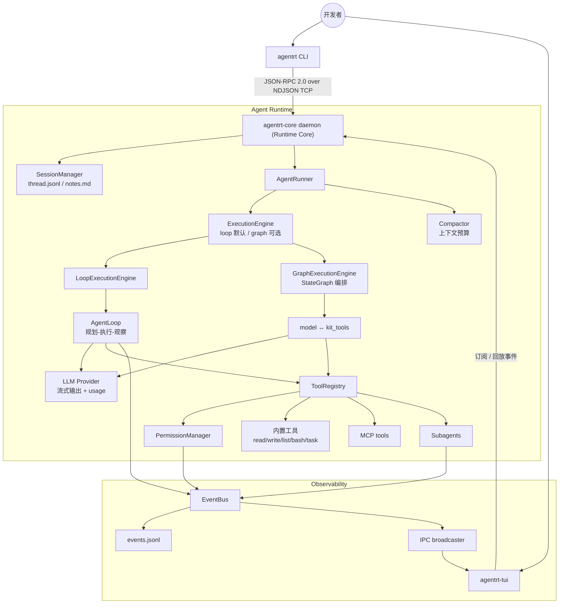

# Agent Runtime Kit

面向本地自动化任务的 AI Agent 运行时框架，提供常驻 Agent Runtime Core、类型化 IPC、实时事件流、工具权限控制、会话记忆、上下文压缩、子 Agent 以及 MCP 工具接入。

中文 | [English](README.en.md)

[](https://github.com/zed123214/agent-runtime-kit/actions/workflows/ci.yml)
[](https://www.python.org/)
[](https://docs.pydantic.dev/)
[](https://textual.textualize.io/)
[](LICENSE)

## 项目定位

现代 AI Agent 不应只是一次 LLM API 调用封装。一个可用的本地 Agent 运行时需要具备：长期运行的执行进程、类型化 IPC、可观察的事件流、安全的本地工具执行、可持久化的会话记忆，以及统一的扩展模型，用于接入工具、Skills、子 Agent 和 MCP Server。

Agent Runtime Kit 使用 Python 实现这些 Agent Runtime 基础能力。当前 provider 实现基于 Anthropic 模型，但系统核心围绕 provider 边界设计：项目重点不是模型本身，而是模型外围的 Runtime Core、通信协议、工具调用、权限审批、会话管理和事件基础设施。

## 支持的运行环境

本仓库主要面向 Linux/macOS 风格环境。由于当前运行手册、进程控制命令和 Shell 工具行为依赖 POSIX 语义，暂不将原生 Windows 作为主要运行目标。

在 Windows 机器上，建议通过 WSL2 或 Docker 进行运行实验。源码和文档仍然可以直接在 Windows 中阅读和审查。

## 系统架构


```mermaid
graph TD
    User((开发者)) --> CLI["agentrt CLI"]
    User --> TUI["agentrt-tui"]
    CLI -->|JSON-RPC 2.0 over NDJSON TCP| Core["agentrt-core daemon (Runtime Core)"]
    TUI -->|订阅 / 回放事件| Core

    subgraph Runtime["Agent Runtime"]
        Core --> Session["SessionManager\nthread.jsonl / notes.md"]
        Core --> Runner["AgentRunner"]
        Runner --> Engine["ExecutionEngine\nloop 默认 / graph 可选"]
        Engine --> LoopEngine["LoopExecutionEngine"]
        Engine --> GraphEngine["GraphExecutionEngine\nStateGraph 编排"]
        LoopEngine --> Loop["AgentLoop\n规划-执行-观察"]
        GraphEngine --> Graph["model ↔ kit_tools"]
        Loop --> LLM["LLM Provider\n流式输出 + usage"]
        Loop --> Registry["ToolRegistry"]
        Graph --> LLM
        Graph --> Registry
        Registry --> Permission["PermissionManager"]
        Registry --> Builtins["内置工具\nread/write/list/bash/task"]
        Registry --> MCP["MCP tools"]
        Registry --> SubAgent["Subagents"]
        Runner --> Compact["Compactor\n上下文预算"]
    end

    subgraph Observability["Observability"]
        Loop --> EventBus["EventBus"]
        Permission --> EventBus
        SubAgent --> EventBus
        EventBus --> Writer["events.jsonl"]
        EventBus --> Broadcast["IPC broadcaster"]
        Broadcast --> TUI
    end
```

## 核心能力

1. **Runtime Core + CLI/TUI 客户端架构**：`agentrt-core` 常驻进程集中管理会话、执行与事件状态；实时会话与创建连接绑定，断连时取消其在途工作，已持久化事件可凭强随机 Run ID 只读回放。
2. **类型化 IPC**：使用 Pydantic 建模请求、响应、错误和事件，并通过 JSON-RPC 2.0 over NDJSON TCP 暴露进程间通信协议。
3. **协议文档自动生成**：`WIRE_PROTOCOL.md` 从源码协议模型生成，降低手写协议文档与代码实现发生漂移的风险。
4. **可替换执行引擎**：`AgentRunner` 通过类型化 `ExecutionEngine` 边界运行默认 `loop` 引擎；可选 `graph` 引擎用显式 `model ↔ kit_tools` 状态图调度，同时复用既有模型、工具、权限、事件和 SessionStore 链路。
5. **ToolRegistry + PermissionManager**：内置工具和 MCP 工具共享 schema 校验、权限判断、事件发布和结构化结果返回机制。
6. **Session 记忆**：完整消息历史保存到 `thread.jsonl`，经过整理的长期事实保存到 `notes.md`。
7. **上下文治理**：支持 tool result 截断、context 水位监控，以及用 compact 摘要替换过大的历史上下文。
8. **Skills、Subagents 与 MCP**：Markdown Skills、隔离上下文的子 Agent 和 MCP 工具复用同一套工具注册、权限、事件和运行器基础设施。

## 简历映射

| 简历表述 | 仓库 |
| --- | --- |
| Runtime Core + CLI/TUI 多进程架构 | `src/agent_runtime/core/app.py`、`src/agent_runtime/cli/`、`src/agent_runtime/tui/`、`docs/architecture.md` |
| JSON-RPC 2.0 over NDJSON TCP | `src/agent_runtime/core/bus/`、`src/agent_runtime/core/transport/`、`WIRE_PROTOCOL.md` |
| 类型安全的协议边界 | Pydantic 协议模型、strict `mypy`、自动生成的 `WIRE_PROTOCOL.md` |
| 可观察事件流 | `EventBus`、`events.jsonl`、可回放的客户端事件订阅 |
| Runtime 层工具权限控制 | `src/agent_runtime/core/permissions/`、`docs/tool-permissions.md`、`examples/permissions/` |
| 可恢复的 LLM/工具执行闭环 | `src/agent_runtime/core/loop.py`、`src/agent_runtime/core/runner.py`、单元测试和集成测试 |
| Session 记忆与上下文治理 | `src/agent_runtime/core/session/`、`src/agent_runtime/core/compact/`、`docs/session-memory.md` |
| 统一扩展模型 | `src/agent_runtime/core/skills/`、`src/agent_runtime/core/subagent/`、`src/agent_runtime/core/mcp/`、`examples/` |

## 快速开始

### 环境要求

- Linux/macOS、WSL2 或 Docker
- Python 3.12
- [uv](https://docs.astral.sh/uv/)
- 真实 LLM 运行需要配置 `ANTHROPIC_API_KEY`

### 安装

```bash
git clone https://github.com/zed123214/agent-runtime-kit.git
cd agent-runtime-kit
uv sync
```

### 配置

```bash
cp .env.example .env
```

示例：

```env
AGENTRT_HOST=127.0.0.1
AGENTRT_PORT=7437
AGENTRT_LOG_LEVEL=INFO
AGENTRT_LOG_FILE=~/.agentrt/logs/core.log
AGENTRT_LOG_FORMAT=text
# ANTHROPIC_API_KEY=sk-ant-your-key-here
# AGENTRT_LLM_DEFAULT_MODEL=claude-sonnet-4-6
# AGENTRT_MAX_STEPS=20
# AGENTRT_ENGINE=loop
```

不要提交真实 API Key。请将本地密钥保存在 `.env` 或 shell 环境变量中。

### 运行

四个命令/文件工具通过 Sandbox Runtime 执行，默认配置无需修改。
如需显式声明，可在 `.agentrt/config.toml` 中添加：

```toml
[sandbox]
backend = "local"
```

环境变量 `AGENTRT_SANDBOX_BACKEND=local` 可覆盖 TOML。M0 的 Local 沿用宿主
cwd、绝对路径和文件系统，不提供物理隔离；释放环境不会删除项目或用户文件。
`kubernetes` 在 M0 会在启动监听前明确报尚未实现，其他未交付的 Sandbox 配置字段也会报错。
本阶段代码与新增测试用例未测试/未验收，详见
[M0 实现与使用说明](docs/sandbox-m0-implementation.md)。

```bash
uv run agentrt-core
uv run agentrt ping
uv run agentrt run --goal "Inspect this repository and summarize the project structure"
uv run agentrt-tui
```

### 可选 LangGraph 引擎与 SQLite 恢复（P1/P2）

原快速开始保持 `loop` 默认值，不安装 Graph 依赖。Graph 只负责显式编排，
KitAgent 继续负责 Provider、原生消息、工具与权限治理、事件、SessionStore 和
Runner 唯一终态。启用方式（PowerShell）：

```powershell
uv sync --extra graph
$env:AGENTRT_ENGINE = 'graph'
uv run agentrt-core
```

在第二个 PowerShell 窗口连接会话：

```powershell
$env:AGENTRT_ENGINE = 'graph'
uv run agentrt chat
```

默认 Graph backend 使用进程内 `InMemorySaver` 续接同一 Session，并按 thread
隔离；`thread.jsonl` 仍是权威会话记录。需要 `agentrt-core` 重启恢复与人工审批续接时，
显式启用 SQLite backend：

```powershell
uv sync --extra graph-sqlite
$env:AGENTRT_ENGINE = 'graph'
$env:AGENTRT_GRAPH_CHECKPOINT_BACKEND = 'sqlite'
$env:AGENTRT_DATA_ROOT = 'D:\agentrt-data'
uv run agentrt-core
```

P2 使用官方异步 SQLite saver 保存 Graph state/interrupt，以独立 RecoveryStore
保存 capability hash、恢复 lease、transcript 提交进度和工具调用 journal；同一
logical run 跨恢复沿用 run ID 与单调事件游标。配置与内存兼容见
[Optional LangGraph Engine](docs/graph-engine.md)，完整恢复、HITL、崩溃窗口和边界见
[Durable Graph Recovery and Human Approval](docs/durable-recovery.md)。

## 事件流示例

```json
{"type":"run.started","run_id":"20260629-101500-a1b2c3d4e5f67890a1b2c3d4e5f67890","correlation_id":"20260629-101500-a1b2c3d4e5f67890a1b2c3d4e5f67890","session_id":"sess-abc123","node_id":null,"event_seq":1,"goal":"...","ts":"..."}
{"type":"llm.token","run_id":"20260629-101500-a1b2c3d4e5f67890a1b2c3d4e5f67890","correlation_id":"20260629-101500-a1b2c3d4e5f67890a1b2c3d4e5f67890","session_id":"sess-abc123","node_id":null,"event_seq":2,"token":"I","ts":"..."}
{"type":"tool.call_started","run_id":"20260629-101500-a1b2c3d4e5f67890a1b2c3d4e5f67890","correlation_id":"20260629-101500-a1b2c3d4e5f67890a1b2c3d4e5f67890","session_id":"sess-abc123","node_id":null,"event_seq":3,"tool_use_id":"toolu_01","tool_name":"list_dir","params":{},"ts":"..."}
{"type":"permission.requested","run_id":"20260629-101500-a1b2c3d4e5f67890a1b2c3d4e5f67890","correlation_id":"20260629-101500-a1b2c3d4e5f67890a1b2c3d4e5f67890","session_id":"sess-abc123","node_id":null,"event_seq":4,"tool_use_id":"toolu_02","tool_name":"bash","params":{"command":"..."},"param_preview":"command=...","ts":"..."}
{"type":"tool.call_finished","run_id":"20260629-101500-a1b2c3d4e5f67890a1b2c3d4e5f67890","correlation_id":"20260629-101500-a1b2c3d4e5f67890a1b2c3d4e5f67890","session_id":"sess-abc123","node_id":null,"event_seq":5,"tool_use_id":"toolu_01","tool_name":"list_dir","elapsed_ms":3,"output":"...","ts":"..."}
{"type":"run.finished","run_id":"20260629-101500-a1b2c3d4e5f67890a1b2c3d4e5f67890","correlation_id":"20260629-101500-a1b2c3d4e5f67890a1b2c3d4e5f67890","session_id":"sess-abc123","node_id":null,"event_seq":6,"status":"success","reason":null,"steps":2,"error":null,"ts":"..."}
```

## 仓库结构

```text
agent-runtime-kit/
|-- README.md
|-- README.en.md
|-- RUNBOOK.md
|-- WIRE_PROTOCOL.md
|-- docs/
|   |-- architecture.md
|   |-- agent-loop.md
|   |-- graph-engine.md
|   |-- durable-recovery.md
|   |-- tool-permissions.md
|   |-- session-memory.md
|   |-- skills-subagents-mcp.md
|   `-- project-highlights.md
|-- examples/
|   |-- graph_offline_demo.py
|   |-- durable_recovery_demo.py
|   |-- basic_run/
|   |-- permissions/
|   |   `-- trace_permission_flow.py
|   |-- skills/
|   `-- mcp/
|-- scripts/
|   |-- generate_wire_protocol.py
|   `-- check_wire_protocol.py
|-- src/agent_runtime/
|   |-- cli/
|   |-- tui/
|   `-- core/
|       |-- app.py
|       |-- engine/
|       |   |-- base.py
|       |   |-- loop_engine.py
|       |   `-- router.py
|       |-- graph/
|       |-- runner.py
|       |-- loop.py
|       |-- bus/
|       |-- transport/
|       |-- tools/
|       |-- permissions/
|       |-- session/
|       |-- compact/
|       |-- skills/
|       |-- subagent/
|       |-- mcp/
|       `-- trace/
`-- tests/
    |-- unit/
    `-- integration/
```

## 开发与检查

基础安装不包含 LangGraph，可运行基础检查与非 Graph、非在线集成测试：

```bash
uv run ruff check src tests scripts examples
uv run ruff format --check src tests scripts examples
uv run pytest tests/ -m "not graph and not recovery and not integration" -v
uv run python scripts/check_wire_protocol.py --check
```

完整源码类型检查会检查 SQLite recovery 模块，因此需安装 graph-sqlite extra：

```bash
uv sync --extra graph
uv run pytest tests/ -m "graph and not recovery and not integration" -v
uv sync --extra graph-sqlite
uv run mypy src
uv run pytest tests/ -m "recovery and not integration" --strict-markers -v
```

原生 Windows 下，如果 `uv` 脚本入口出现 trampoline path 错误，可以改用 Python 模块方式运行工具：

```bash
uv run python -m mypy src
uv run python -m pytest tests/ -v
```

修改 `src/agent_runtime/core/bus/` 下的协议模型后，重新生成协议文档：

```bash
uv run python scripts/generate_wire_protocol.py
```

## 文档

- [Architecture](docs/architecture.md)
- [Agent Loop](docs/agent-loop.md)
- [Optional LangGraph Engine](docs/graph-engine.md)
- [Durable Graph Recovery and Human Approval](docs/durable-recovery.md)
- [Tool Permissions](docs/tool-permissions.md)
- [Session Memory](docs/session-memory.md)
- [Skills, Subagents, and MCP](docs/skills-subagents-mcp.md)
- [Project Highlights](docs/project-highlights.md)
- [Runbook](RUNBOOK.md)
- [Wire Protocol](WIRE_PROTOCOL.md)

## 安全说明

- `.env`、日志、会话数据、缓存、虚拟环境和本地工作区不应提交到仓库。
- Shell、文件写入和外部 MCP 工具在执行前都会经过权限系统。
- 这是一个作品集和学习项目。若用于生产环境，还需要补充沙箱隔离、安全审查、资源隔离和运维加固。

## License

MIT License. See [LICENSE](LICENSE).
